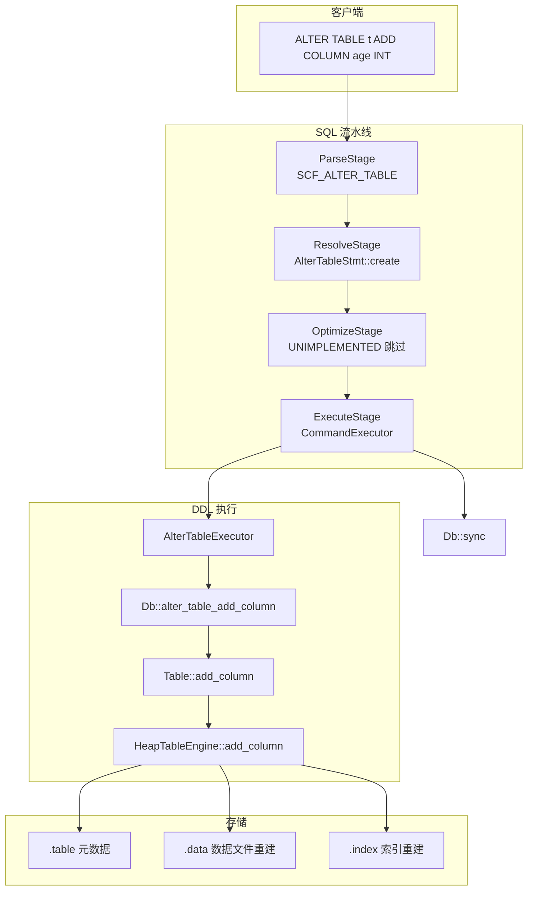
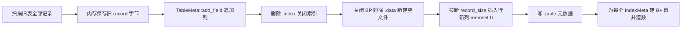

# ALTER TABLE 设计方案（ADD COLUMN）

> 工程：`C:\Users\HUAWEI\Desktop\project2\miniob`  
> 前提：DROP TABLE 已实现；本方案实现训练营常见语法 **`ALTER TABLE t ADD COLUMN col type`**（`COLUMN` 可省略）。

---

## 一、需求范围

| 支持 | 不支持（本期） |
|------|----------------|
| `ALTER TABLE t ADD [COLUMN] c INT` | `DROP COLUMN` / `RENAME` / 改类型 |
| `ALTER TABLE t ADD c CHAR(n)` / `FLOAT` | 多列一次 ADD |
| 表必须存在；列名不可重复 | LSM 存储引擎 |
| 已有行：新列填 **0**（二进制零） | 带 DEFAULT 子句 |

**错误语义（与 DROP/CREATE 一致）**

| 场景 | RC |
|------|-----|
| 表不存在 | `SCHEMA_TABLE_NOT_EXIST` |
| 列已存在 | `SCHEMA_TABLE_EXIST` |
| 成功 | `SUCCESS` → 客户端 SUCCESS |

---

## 二、总体架构（对称 DROP TABLE）



---

## 三、核心难点：定长记录 + 页内 record_size

- Heap 表每页在创建时固定 `record_real_size` / `record_size`（见 `record_manager.cpp`）。
- **仅在表尾追加列**时，旧字段 offset 不变，但 **整行变长**，旧页槽位无法原地扩容。
- **策略**：扫描导出旧行 → 更新 `TableMeta` → **删除并重建 `.data`** → 按新长度插回 → **按元数据重建所有索引文件**。



---

## 四、模块划分

| 层级 | 新增/修改 |
|------|-----------|
| Parser | `lex_sql.l`：ALTER/ADD/COLUMN；`yacc_sql.y`：`alter_table_stmt`；`parse_defs.h`：`AlterTableSqlNode`、`SCF_ALTER_TABLE` |
| Stmt | `alter_table_stmt.h/.cpp`；`stmt.h` 增加 `ALTER_TABLE`；`stmt.cpp` 分支 |
| Executor | `alter_table_executor.h/.cpp`；`command_executor.cpp` |
| 存储 | `TableMeta::add_field`；`HeapTableEngine::add_column`；`Table::add_column`；`Db::alter_table_add_column` |
| DDL | `stmt_type_ddl` 包含 `ALTER_TABLE` |

---

## 五、数据迁移伪代码

```text
old_size = table_meta.record_size()
for each record in heap_scanner:
    save memcpy(record, old_size)

new_meta = copy(table_meta)
new_meta.add_field(attr)   // 仅追加到 fields_ 尾部

close indexes; remove *.index files
close data_buffer_pool; remove *.data; create empty *.data
table_meta.swap(new_meta)
init record_handler with new_meta

for each saved_old_bytes:
    new_buf = calloc(new_meta.record_size())
    memcpy(new_buf, saved_old, old_size)  // 尾部新列已为 0
    insert_record(new_buf)                // 此时无索引

persist table_meta to .table (tmp + rename)
for each index in table_meta:
    create B+ tree file + full table scan insert_entry
```

---

## 六、与 DROP TABLE 的关系

- **不修改** `DropTableStmt` / `Table::drop` / `Db::drop_table` 逻辑。
- ALTER 只改单表元数据与数据文件，不触碰 catalog 中其它表。
- DDL 结束后仍由 `CommandExecutor` 调用 `Db::sync()`。

---

## 七、测试设计（任务三/四）

1. 空表 ADD COLUMN → DESC/SELECT 可见新列  
2. 有数据表 ADD COLUMN → 旧列保留，新列 0  
3. 重复 ADD 同名列 → FAILURE  
4. 不存在的表 → FAILURE  
5. 带索引表 ADD COLUMN → SELECT / 索引查询仍正确  
6. ADD 后 INSERT 新列、CREATE INDEX 于新列  

自动化：`scripts/run_alter_table_test.sh`（模式同 `run_drop_table_test.sh`）。

---

*文档版本：ALTER TABLE 任务启动*
